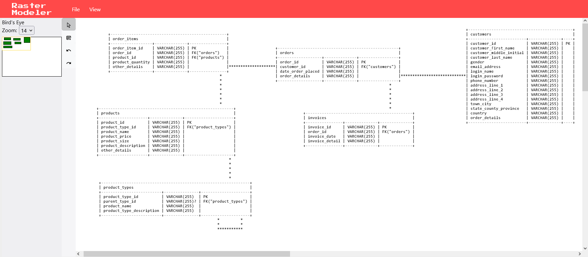

# RasterModeler

Open source text based ERD schema drawing tool with scripting support. Start modeling in your browser [here](https://oskar-anderson.github.io/RasterModeler) 📐

## About
Webapp for text based ERD schema creation. The app allows users to create JavaScript scripts and execute them based on the schema. Contains built-in scripts and user created scripts shared as comments.

### Main drawing view
Everything needed to visualise database tables. Create/read/update/delete tables, export schema as PNG or TXT, import TXT schemas, change zoom level or navigate schema. Also supports undo/redo functionality.



### Scripting editor view
Write executable JavaScript in Monaco Editor (Visual Studio Code) based on schema data. Alternatively use app built-in scripts or user shared scripts from Giscus comments.


Check demo video- https://www.youtube.com/watch?v=Qnqnqw68eeo

## Running Locally

1. Make sure to change `.env` variable `VITE_BASE_URL` to match the environment before running any commands 
```
http://localhost:8080 
OR
https://oskar-anderson.github.io/RasterModeler
``` 


2. Start the app server
```
// track changes and auto-update
npm run dev

// build and run manually
npm run build
npm run preview
```

3. Visit http://localhost:8080

## Known problems
* Sometimes draw screen text will be blurry even with browser zoom at 100%.
* Files in public directory cannot be prefixed with underscores (_). Do not use underscores.

## Todo
* Script tagging and filtering
* Add hidden semantic description field on table row fields to allow better documentation generation. Saving has to be reworked to include extra values on top of the schema
* More scripts (documentation, code generation, ORM)
