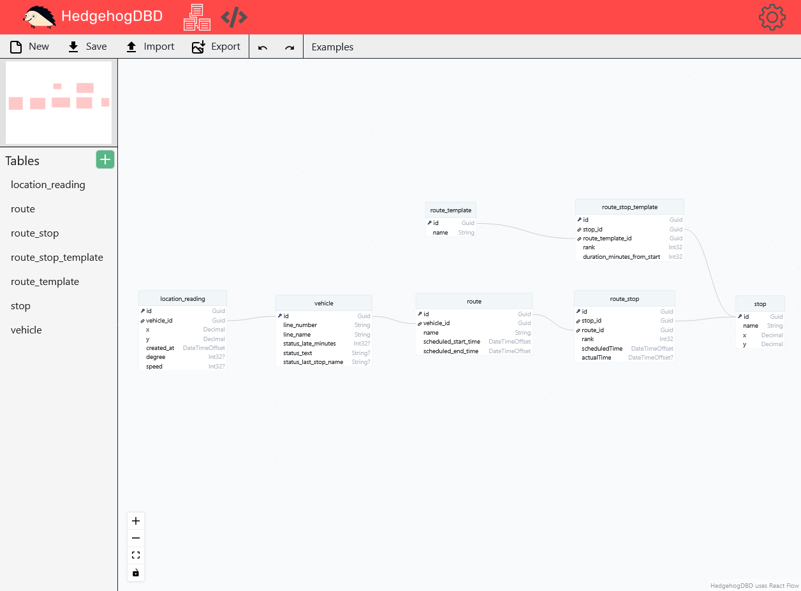

# RasterModeler

Open source text based ERD schema drawing tool with scripting support. Start modeling in your browser [here](https://oskar-anderson.github.io/RasterModeler/pages/draw.html) 📐

## About
Webapp for text based ERD schema creation. The app allows users to create JavaScript scripts and execute them based on the schema. Contains built-in scripts and user created scripts shared as comments.

### Main drawing view
Everything needed to visualise database tables. Create/read/update/delete tables, export schema as PNG or TXT, import TXT schemas, change zoom level or navigate schema. Also supports undo/redo functionalty.

### Scripting editor view
Write executable JavaScript in Monaco Editor (Visual Studio Code) based on schema data. Alternatively use app built-in scripts or user shared scripts from Giscus comments.

Check demo video- https://www.youtube.com/watch?v=Qnqnqw68eeo

## Local installation
1. `npm run build`
2. `python pyServer.py`
3. Visit http://127.0.0.1:1337/webapp/pages/draw.html

## Todo
* Script tagging and filtering
* Add hidden semantic description field on table row fields to allow better documentation generation. Saving has to be reworked to include extra values on top of the schema
* More scripts (documentation, code generation, ORM)
